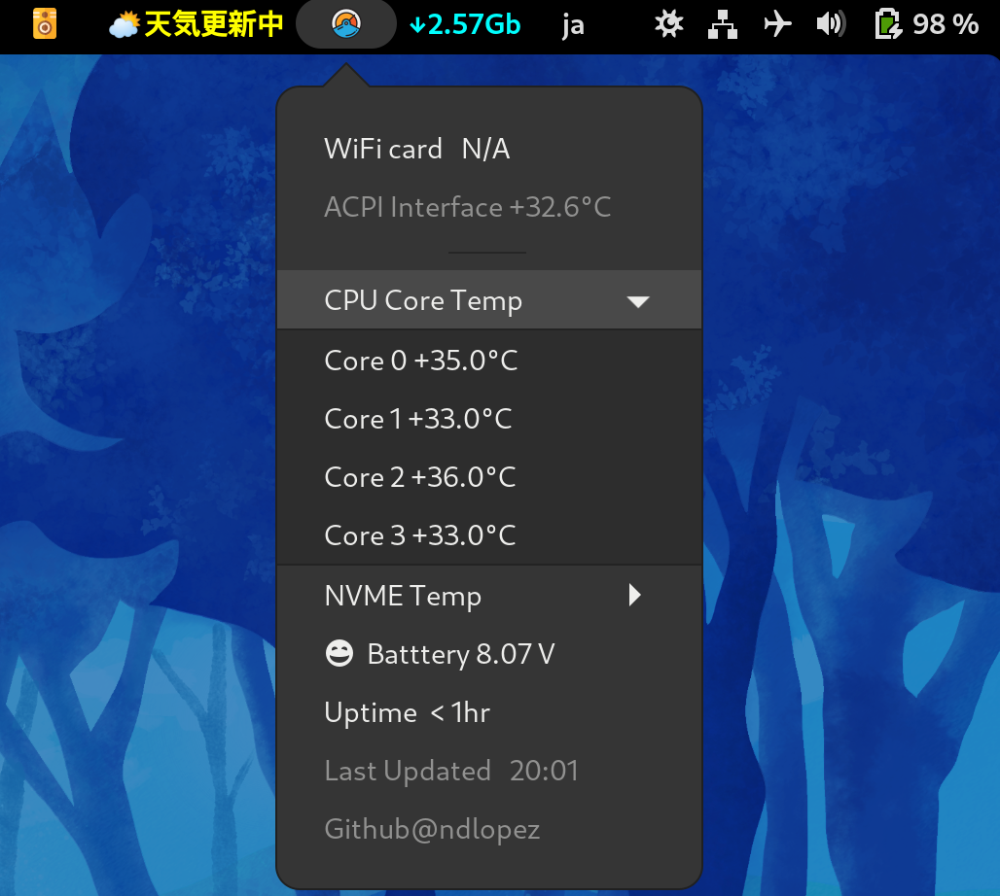

# GNOME Utilities

Display on the Gnome task bar utilities to show audio-jack status, current amount of downloaded data, and current temperatures of CPU/SDD/WiFi card.

#Known issues
1. ondo@moji.physics might not work on your system. It requires <sensors> CLI app to run the Shell script. It does not auto-update. Please log back in or lock and unlock back your session.
2. audio_stat does not update as soon yopu plugin/out a headphone. It updates once you log back.
3. Currently neptuno_stat displays downloaded data using a LAN connection. This is the only extension that auto-updates every 3minutes. Please refer to the included Shell script and chance the device name.

---
Environment: Panasonic Let'sNote, Fedora Linux 34

Language: JavaScript, Shell, and a lil' Python

Editor: VIM

